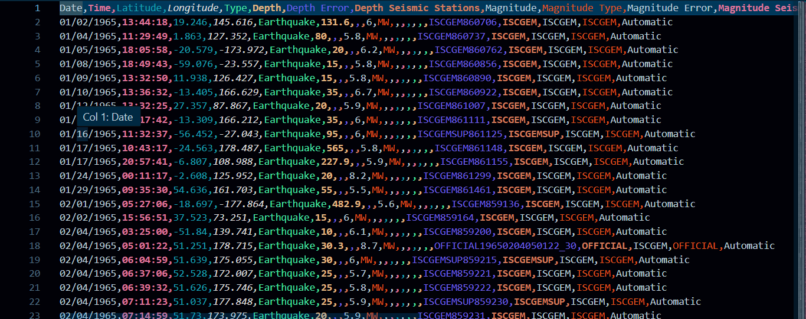
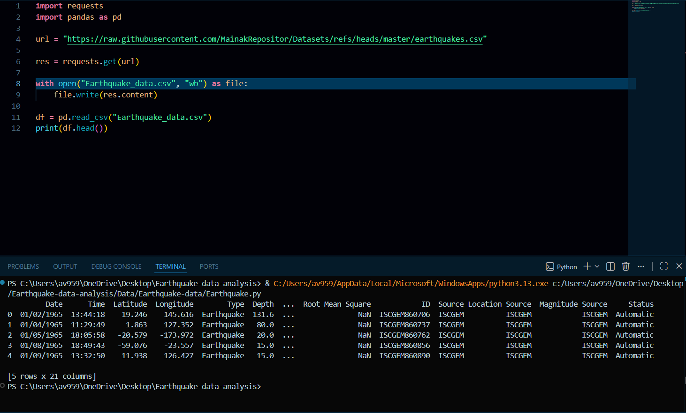
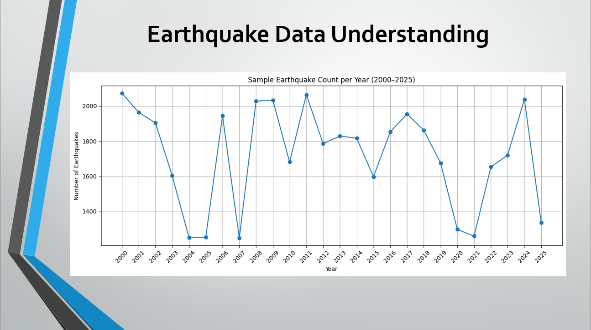

# VAUTECH IT SOLUTIONS – TASK 1

**Intern:** Ansh Verma

**Intern ID:** VT26DS001

**Domain:** Data Science

**Company:** VAUTECH IT SOLUTIONS

**Mentor:** Vishal Rajbhar

---

## Task: Understanding EarthQuake Data

For this task, I worked with a real-world earthquake dataset containing information about seismic activities recorded across different regions and time periods. The main purpose of this task was to understand what the dataset represents, what type of information it contains, and how it can be used to study real-life problems related to natural disasters.

The dataset includes details such as earthquake magnitude, depth, latitude, longitude, location, and date/time of occurrence.

**Dataset Source:**
https://raw.githubusercontent.com/MainakRepositor/Datasets/refs/heads/master/earthquakes.csv

## Why i chose this dataset

I chose this dataset because earthquakes are one of the most dangerous natural disasters and can cause massive loss of life and property. By analyzing earthquake data, we can understand patterns of seismic activity, identify high-risk areas, and support disaster preparedness and risk management efforts

## What this data can help us find

by this dataset, we can try to answer questions like?

- Which regions experience earthquakes most frequently?
- What is the distribution of earthquake magnitudes?
- Are most earthquakes shallow or deep?
- How has earthquake activity changed over time?

## Goal of this task

> To understand the earthquake dataset, interpret its real-world meaning, and define what kind of analysis can be performed in future tasks.

## What i have learned from this task

- How to interpret a dataset in a real-world context.
- How to understand the background and purpose of a dataset.
- The importance of defining clear objectives before starting analysis.

## 📸 Task 1 Screenshots (Problem Understanding & Documentation)

### Dataset Preview

### Import Data Set

### PT Documentation

## Project Structure

- Data/ : Contains raw dataset files
- Images/ : Contains screenshots

---

## Conclusion

This task helped me understand how earthquake data represents real-world seismic activity and its impact on society. Before performing any analysis, understanding the context and structure of the data is essential. This task provided a strong foundation for performing data cleaning, visualization, and advanced analysis in the next stages of the project.
